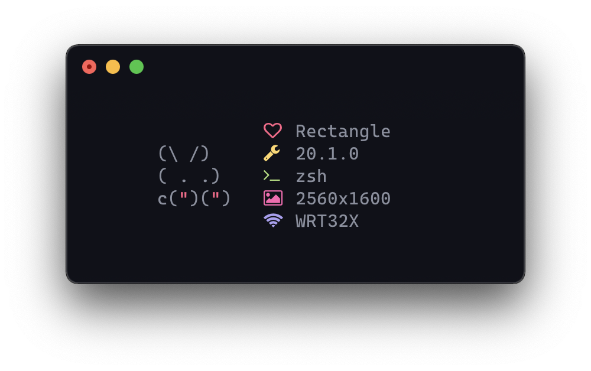

# bunnyfetch
> 🐰 macOS version of [elenapan's bunnyfetch](https://github.com/elenapan/dotfiles/blob/master/bin/bunnyfetch).

## Installation
```
brew install strafe/tap/bunnyfetch
```

## Usage
```
$ bunnyfetch
```
<center></center>

## License
[MIT](LICENSE)
